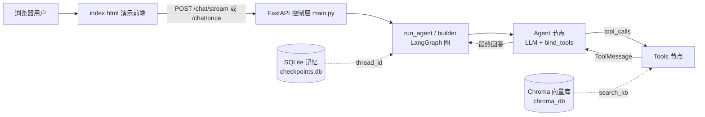

# LangGraph Agentic RAG 测试助手

基于 **LangGraph + DeepSeek** 构建的测试团队 AI 助手。支持 RAG 知识库检索、工具调用（ReAct 循环）、多轮对话记忆持久化与流式输出，并额外封装了一层 **FastAPI 服务 + 前端演示页**，可直接在浏览器里对话。

> 📊 可观测性已接入：项目通过根目录 `.env` 中的 `LANGSMITH_TRACING` / `LANGSMITH_API_KEY` / `LANGSMITH_PROJECT` 开启 LangSmith 链路追踪。LangChain / LangGraph 会自动读取这些环境变量并上报 trace，**无需改代码**。密钥仅存于本地 `.env`（已 gitignore），切勿提交或写进文档。

## 核心特性

- **Agentic RAG 管道（ReAct 循环）**：用户提问 → LLM 决策 → 工具调用 → 结果回传 → 生成答案，由 `tools_condition` 自动路由。
- **四类真实工具**：`calculator`（计算）、`search_kb`（知识库检索）、`get_weather`（实时天气）、`scrape_web`（网页爬取），均带异常处理与优雅降级。
- **向量知识库**：HuggingFace 本地 Embedding + Chroma 向量库，L2 距离阈值过滤做召回精筛（建库见 `ingest.py`）。
- **记忆持久化**：`AsyncSqliteSaver` 将对话落盘到 `checkpoints.db`，进程重启后多轮记忆不丢失，`thread_id` 隔离不同会话。
- **流式 / 非流式双接口**：`astream(stream_mode="messages")` 逐 token 输出，区分 AIMessage / ToolMessage；另提供一次性返回接口方便调试与第三方集成。
- **服务化封装**：FastAPI 暴露 HTTP 接口，前端（`index.html`）同源托管，浏览器打开即用。
- **可观测性**：根目录 `.env` 配置 LangSmith（`LANGSMITH_TRACING` / `LANGSMITH_API_KEY` / `LANGSMITH_PROJECT`），运行时自动 trace 每次 LLM 调用与工具调用的输入输出、耗时与调用链路，无需额外代码。

## 系统架构



## 项目结构

```
langgraph_rag_agent/
├── agent.py          # LangGraph 图定义 + run_agent 流式生成器 + builder
├── tools.py          # 四个 @tool 工具：calculator / search_kb / get_weather / scrape_web
├── main.py           # FastAPI 控制层：/chat/stream、/chat/once、/ 静态托管
├── index.html        # 三栏演示前端，fetch 消费 SSE / JSON
├── ingest.py         # 建库脚本：加载 data/knowledge.txt → 分块 → Embedding → Chroma
├── state.py          # 状态定义参考（当前 agent.py 用内置 MessagesState，此文件未直接引用）
├── data/
│   └── knowledge.txt # 测试规范 / 缺陷管理 / 回归流程等知识库原文
├── requirements.txt  # 依赖清单
├── chroma_db/        # 向量库持久化目录（由 ingest.py 生成）
└── checkpoints.db    # 对话记忆落盘（运行时生成）
```

## 环境准备

1. 安装依赖（建议用项目 conda 环境 `langgraph`）：

   ```bash
   pip install -r requirements.txt
   ```

2. 在项目根目录创建 `.env` 文件，填入 DeepSeek 的 OpenAI 兼容密钥与地址：

   ```ini
   DEEPSEEK_API_KEY=你的_key
   DEEPSEEK_API_BASE=https://api.deepseek.com/v1
   # 可选：如需链路追踪，追加以下 LangSmith 变量（详见「可观测性」章节）
   LANGSMITH_TRACING=true
   LANGSMITH_API_KEY=你的_langsmith_key
   LANGSMITH_PROJECT=my_langgraph_agent
   ```

3. 构建知识库（首次运行或更新语料后执行）：

   ```bash
   python ingest.py
   ```

   > 注：Embedding 走 HuggingFace 本地模型，默认镜像 `https://hf-mirror.com`（见 `agent.py` 顶部 `HF_ENDPOINT`）。若已缓存可设 `HF_HUB_OFFLINE=1` 走离线模式。

## 运行

启动 FastAPI 服务（任选其一）：

```bash
uvicorn main:app --reload --port 8000
# 或
python main.py
```

启动后浏览器打开 **http://127.0.0.1:8000** 即可使用演示前端。

## API 接口

| 方法 | 路径           | 说明                                                                 | 请求体                              | 返回                         |
| ---- | -------------- | -------------------------------------------------------------------- | ----------------------------------- | ---------------------------- |
| POST | `/chat/stream` | SSE 流式输出，逐 token 返回（`text/event-stream`），对应 `run_agent` | `{"query": "...", "thread_id": "session_001"}` | `data: {token}\n\n` 流       |
| POST | `/chat/once`   | 非流式，等全部生成完一次性返回完整文本，便于调试 / 集成              | `{"query": "...", "thread_id": "session_001"}` | `{"answer": "完整回答"}`     |
| GET  | `/`            | 同源托管演示前端 `index.html`                                        | —                                   | HTML 页面                    |

请求体与返回示例（非流式）：

```bash
curl -X POST http://127.0.0.1:8000/chat/once \
  -H "Content-Type: application/json" \
  -d '{"query":"帮我查测试规范","thread_id":"session_001"}'
```

```json
{"answer":"根据知识库，测试规范主要包括……"}
```

> 跨域：已通过 `CORSMiddleware` 开放 `allow_origins=["*"]`，方便本地前端 / Postman 联调。

## 关键设计点

- **ReAct 循环**：`builder` 用 `StateGraph(MessagesState)` 搭图，`agent` 节点调用 `llm_with_tools`，`tools_condition` 决定是继续调用工具还是结束。
- **流式实现引擎是 `yield`**：`run_agent` 是异步生成器，过滤掉 HumanMessage / ToolMessage，只把 AI 文本 chunk 透传给 SSE。
- **记忆按线程隔离**：同一个 `thread_id` 在 `AsyncSqliteSaver` 中对应同一段对话历史，多轮上下文不丢失。
- **防幻觉两层过滤**：向量分数粗筛（L2 距离阈值）+ 系统提示强制"必须调用 `search_kb` 后再回答，禁止凭记忆编造"。

## 可观测性（已接入 LangSmith）

项目已通过环境变量接入 LangSmith 链路追踪，**无需任何代码改动**——这是 LangChain / LangGraph 的标准做法：只要运行环境里存在以下变量，框架会自动上报 trace。

在根目录 `.env` 中配置（已 gitignore，勿提交）：

```ini
LANGSMITH_TRACING=true
LANGSMITH_API_KEY=你的_langsmith_key
LANGSMITH_PROJECT=my_langgraph_agent
```

- `LANGSMITH_TRACING=true`：开关，开启后自动 trace 所有 LLM 调用、工具调用与图节点。
- `LANGSMITH_API_KEY`：LangSmith 账号密钥（在 langsmith.com 获取）。
- `LANGSMITH_PROJECT`：trace 归入的项目名，方便在多项目间区分。

> 前置依赖：`langsmith` 包（随 `langchain-core` 一同安装，确保已在环境中）。配置正确后，每次对话都会在看板（LangSmith UI）生成完整调用链路，含每轮工具调用的入参、出参与耗时。

## 已知优化项（待做）

- `main.py` 每次请求都重新打开 `checkpoints.db` 并重编译图；可改用 `lifespan` + `app.state.graph` 启动时建一次、复用。
- 补充 `.env.example` 模板文件，降低新环境配置门槛。
- 知识库召回阈值目前为硬编码，可下沉为配置项。
